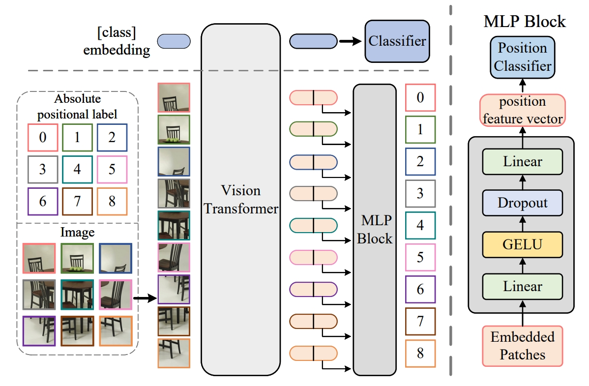
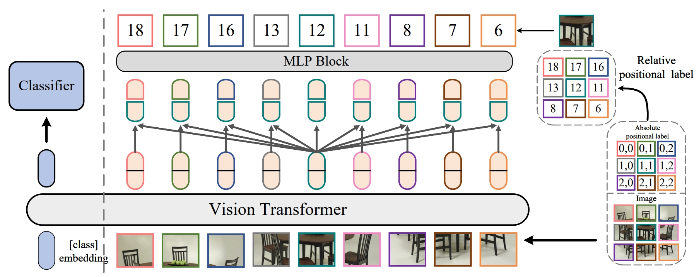

# PositionalLabel
This repo is the implementation of ["Positional Label for Self-Supervised Vision Transformer"](https://arxiv.org/pdf/2206.04981.pdf).

## Introduction

**Positional Label** is initially described in [arxiv]( https://arxiv.org/pdf/2206.04981.pdf). In our work we propose to train ViT to recognize the positional label of patches of the input image, this apparently simple task actually yields a meaningful self-supervisory task. Based on previous work on ViT positional encoding, we propose two positional labels dedicated to 2D images including absolute position and relative position. Our positional labels can be easily plugged into various current ViT variants. It can work in two ways: (a) As an auxiliary training target for vanilla ViT for better performance. (b) Combine the self-supervised ViT to provide a more powerful self-supervised signal for semantic feature learning.

**Absolute positional label**:


**Relative positional label**:


## Main Results on ImageNet-1K and Mini-ImageNet

**ImageNet-1K trained Positional Label Models**

| name | train | resolution |acc@1 | acc@5 | 
| :---: | :---: | :---: | :---: | :---: | 
| ViT-B | ImageNet-1K | 224x224 | 77.91 | 92.48 | 
| DeiT-B | ImageNet-1K | 224x224 | 81.87 | 93.92 | 
| Swin-B | ImageNet-1K | 224x224 | 83.35 | 96.38 | 
| NesT-B | ImageNet-1K | 224x224 | 83.67 | 96.16 | 
| ViT-B + APL | ImageNet-1K | 224x224 | 79.11 | 93.73 | 
| DeiT-B + APL | ImageNet-1K | 224x224 | 82.49 | 94.34 | 
| Swin-B + APL | ImageNet-1K | 224x224 | 83.76 | 96.83 | 
| NesT-B + APL | ImageNet-1K | 224x224 | **84.13** | **96.85** | 
| ViT-B + RPL | ImageNet-1K | 224x224 | 79.07 | 93.67 | 
| DeiT-B + RPL | ImageNet-1K | 224x224 | 82.85 | 94.21 | 
| Swin-B + RPL | ImageNet-1K | 224x224 | 84.09 | 96.77 | 
| NesT-B + RPL | ImageNet-1K | 224x224 | 83.93 | 96.81 | 

**Mini-ImageNet trained Positional Label Models**

| name | train | resolution |acc@1 | acc@5 | 
| :---: | :---: | :---: | :---: | :---: | 
| ViT-B | Mini-ImageNet | 224x224 | 58.28 | 79.57 | 
| DeiT-B | Mini-ImageNet | 224x224 | 63.67 | 83.92 | 
| Swin-B | Mini-ImageNet | 224x224 | 67.39 | 86.88 | 
| NesT-B | Mini-ImageNet | 224x224 | 67.43 | 86.75 | 
| ViT-B + APL | Mini-ImageNet | 224x224 | 64.43 | 83.73 | 
| DeiT-B + APL | Mini-ImageNet | 224x224 | 66.49 | 85.37 | 
| Swin-B + APL | Mini-ImageNet | 224x224 | 68.91 | 87.86 | 
| NesT-B + APL | Mini-ImageNet | 224x224 | 68.73 | 87.95 | 
| ViT-B + RPL | Mini-ImageNet | 224x224 | 63.97 | 83.06 | 
| DeiT-B + RPL | Mini-ImageNet | 224x224 | 66.85 | 85.22 | 
| Swin-B + RPL | Mini-ImageNet | 224x224 | 69.11 | 88.02 | 
| NesT-B + RPL | Mini-ImageNet| 224x224 | **69.56** | **88.67** | 

## Usage

This code is largely based on ["Swin Transformer: Hierarchical Vision Transformer using Shifted Windows"](https://github.com/microsoft/Swin-Transformer). We mainly modified ViT_B.py and swin_transformer.py in the models folder.

### Install

Refer to ["Swin Transformer for Image Classification"](https://github.com/microsoft/Swin-Transformer/blob/main/get_started.md).

### Data preparation

We use standard ImageNet dataset, you can download it from http://image-net.org/. 

- For standard folder dataset, move validation images to labeled sub-folders. The file structure should look like:
  ```bash
  $ tree data
  imagenet
  ├── train
  │   ├── class1
  │   │   ├── img1.jpeg
  │   │   ├── img2.jpeg
  │   │   └── ...
  │   ├── class2
  │   │   ├── img3.jpeg
  │   │   └── ...
  │   └── ...
  └── val
      ├── class1
      │   ├── img4.jpeg
      │   ├── img5.jpeg
      │   └── ...
      ├── class2
      │   ├── img6.jpeg
      │   └── ...
      └── ...
 
  ```

### Training from scratch on ImageNet-1K

To train the Positional Label on ImageNet from scratch, with 2 GPU, run:
```bash
python -m torch.distributed.launch --nproc_per_node 2 --master_port 12345  main.py --cfg configs/swin/swin_tiny_patch4_window7_224.yaml --batch-size 320
```
or
```bash
python -m torch.distributed.launch --nproc_per_node 2 --master_port 12345  main.py --cfg configs/swin/swin_tiny_patch4_window7_224.yaml --batch-size 256
```
## Acknowledgements

This code is largely based on ["Swin Transformer: Hierarchical Vision Transformer using Shifted Windows"](https://github.com/microsoft/Swin-Transformer). We thank the authors a lot for their valuable efforts.

